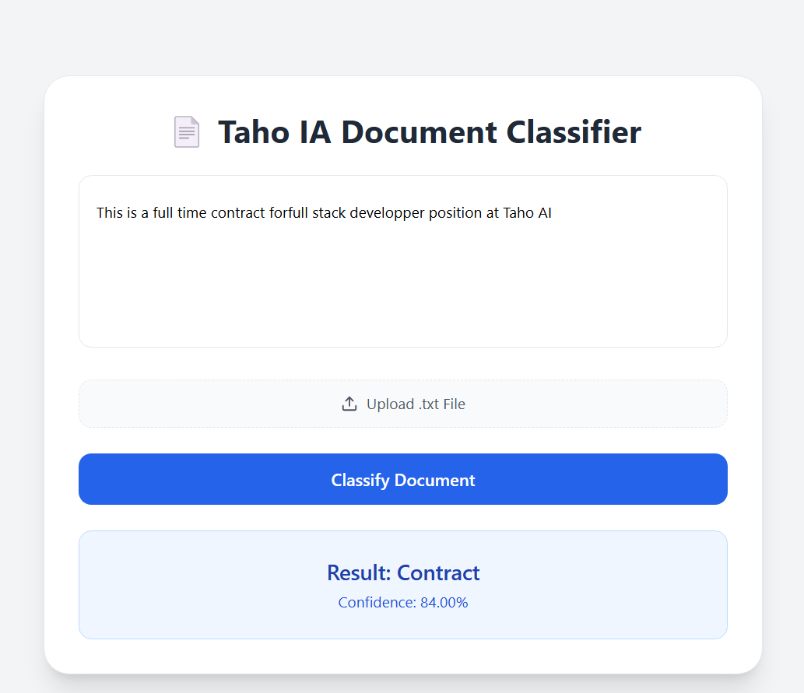
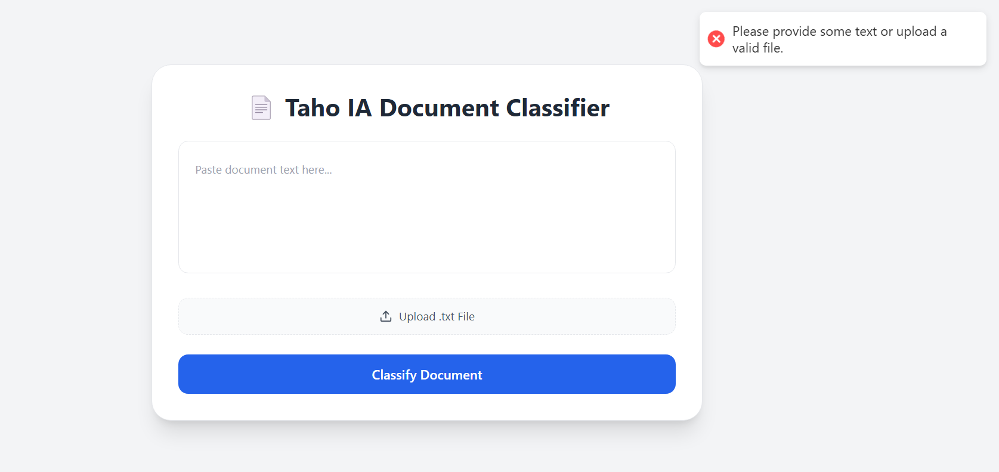

# 🧠 TAHO AI Document Classifier

Welcome to the **TAHO AI Document Classifier** — a modern, full-stack AI-powered tool for classifying documents via text input or `.txt` file uploads. Built with:

- ⚙️ **FastAPI** for backend
- ⚛️ **React + Vite+ Tailwind** for frontend
- 🐳 **Docker** for backend deployment

## 🚀 Features

✅ Paste document text OR upload a `.txt` file  
✅ See label + confidence in clean UI  
✅ Toast-based error handling (e.g., timeouts, large text, etc.)  
✅ Handles missing input & model timeouts gracefully

---

## 🛠️ To run the backend locally without Docker, follow these steps:

### ▶️ Backend (FastAPI)

```bash
cd backend
python -m venv venv
source venv\Scripts\activate.bat
pip install -r requirements.txt
uvicorn app.main:app --reload --port 8000
---

```
## 🐳 Backend — With Docker, follow these steps:

Make sure Docker is installed and running.
```bash
cd taho-ai-doc-backend
docker build -t taho-backend .
docker run -p 8000:8000 taho-backend
---
```

## 🌐  Frontend (React + Vite)

```bash
cd taho-ai-doc-frontend
npm install
npm run dev
---
```
Then visit your frontend app at:
📍 http://localhost:5173

Make sure your backend is running at http://localhost:8000 to receive predictions. 

## 🖼️ Screenshots
📄 Upload File 


📤 Upload Text
 

🚨 Error Handling Screenshots



